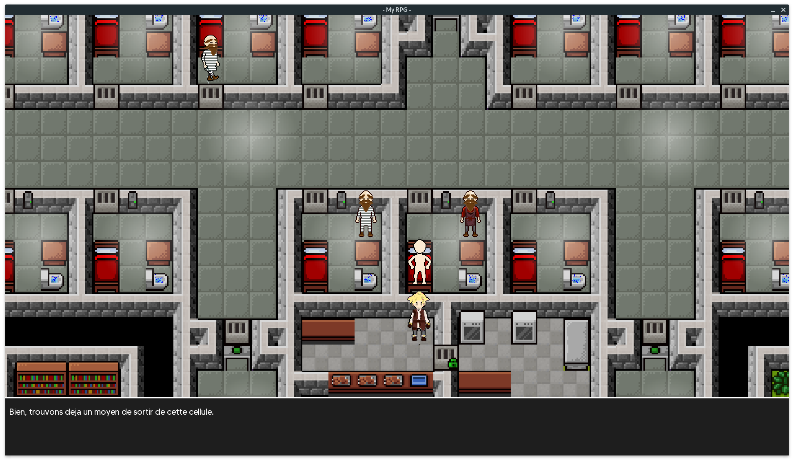

# My_RPG_2019_MUL
Graphical application [Game] - 1st year project

# Contributors
  * [@SimonRacaud](https://github.com/SimonRacaud)
  * [@AurelienJoncour](https://github.com/aurelienjoncour)
  * [@sullmin](https://github.com/sullmin)
  * [@vincent-andrieu](https://github.com/vincent-andrieu)
  * Thomas Jouanolle

# Demo Video

# Trailer Video (keynote)

# Main world

# Menu

# Quests

# Isometric world 

# Mini game

# Credits

